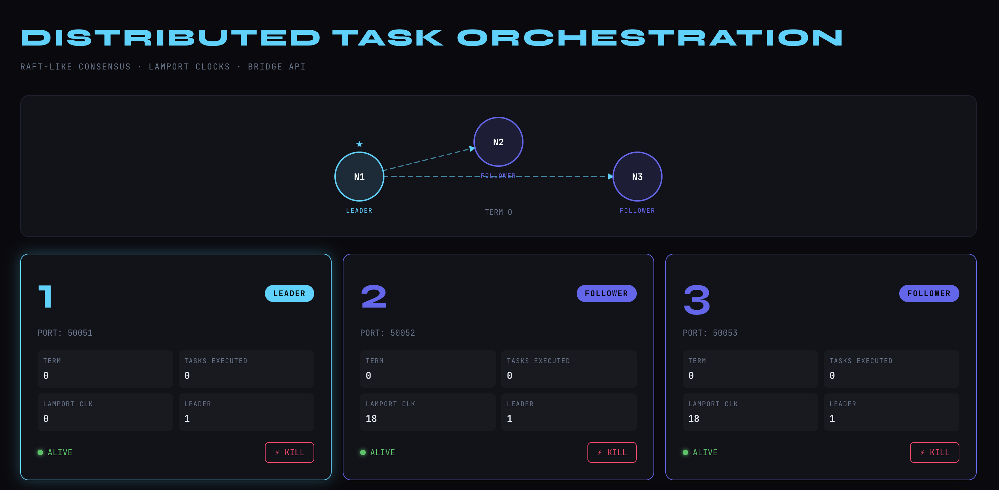
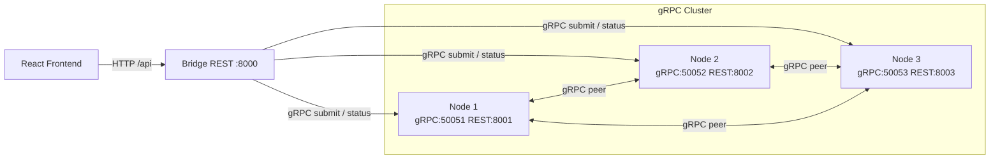

# Distributed Task Orchestration System

A three-node distributed cluster with leader election, Lamport mutual exclusion, and a live React dashboard.



---

## Highlights

- Raft-inspired leader election — heartbeat broadcasting, watchdog re-election, graceful rejoin
- Lamport mutual exclusion — nodes acquire a distributed lock before executing any task
- gRPC for all inter-node communication — heartbeats, lock requests, task forwarding
- REST Bridge — translates frontend HTTP calls into gRPC, handles leader discovery and retries
- Kill / Revive any node from the UI and watch consensus reform in real time
- Unit tested — `TaskExecutor` and `LamportMutex` core logic covered

---

## Architecture

**Nodes** — three independent Spring Boot processes, each running a gRPC server. They elect a leader on startup using a lowest-ID priority rule, then maintain consensus through 1-second heartbeats and a 3-second watchdog timeout.

**Mutex** — before executing a task, the leader broadcasts `acquireLock` to all peers. Each peer grants or defers based on Lamport timestamp ordering, ensuring no two nodes run a task concurrently.

**Bridge** — a lightweight Spring Boot app on port 8000. It exposes a JSON REST API to the frontend, fans out `getStatus` calls to all three nodes, and retries task submission across nodes until one accepts.

**Frontend** — React + Vite, polling `/api/status` every 2 seconds. Displays an animated SVG topology, per-node cards, task submission form, and a scrollable result log.

**Topology**



**Bridge API**

| Endpoint | Method | Description |
|----------|--------|-------------|
| `/api/status` | GET | Aggregated status from all three nodes |
| `/api/task` | POST | Submit a task: `{ "taskType": "compute\|message", "payload": "..." }` |
| `/api/logs` | GET | Last 50 task execution results |
| `/api/kill/{nodeId}` | POST | Simulate a node crash |
| `/api/revive/{nodeId}` | POST | Revive a previously killed node |

**Design Decisions**

| Decision | Reasoning |
|----------|-----------|
| Lowest-ID leader election | Deterministic — same node always leads when alive, makes demos predictable |
| Lamport clocks over a central lock | No single point of failure, teaches the real distributed systems tradeoff |
| Bridge as a separate process | Keeps gRPC internals hidden from the frontend; easy to swap transport later |

---

## Prerequisites

- Java 17+
- Docker & Docker Compose (one-command startup)
- Node.js 18+ (local frontend dev only)

---

## Quickstart (Docker Compose)

```bash
docker compose up --build
```

| Service | URL |
|---------|-----|
| Frontend | http://localhost:5173 |
| Bridge REST API | http://localhost:8000/api |
| Node REST (control) | http://localhost:8001, :8002, :8003 |
| gRPC ports | 50051, 50052, 50053 |

```bash
docker compose down
```

---

## Local Development

```bash
# Build backend
cd backend && ./gradlew bootJar -x test

# Start three nodes (separate shells)
NODE_ID=1 GRPC_PORT=50051 REST_PORT=8001 java -jar build/libs/*.jar
NODE_ID=2 GRPC_PORT=50052 REST_PORT=8002 java -jar build/libs/*.jar
NODE_ID=3 GRPC_PORT=50053 REST_PORT=8003 java -jar build/libs/*.jar

# Start the Bridge (wait ~5s for nodes to be ready)
REST_PORT=8000 java -Dloader.main=com.distributed.bridge.BridgeApp -jar build/libs/*.jar

# Start the frontend
cd frontend && npm install && npm run dev
```

---

## Tests

```bash
cd backend && ./gradlew test
```

| Class | Cases covered |
|-------|--------------|
| `TaskExecutor` | Addition, division by zero, Fibonacci, message reverse, unknown task type |
| `LamportMutex` | Grant with no pending request, grant on lower timestamp, defer on higher timestamp, tie-break by node ID |

---

## Troubleshooting

- **Port conflicts** — ensure 50051–50053 and 8001–8003 are free before starting locally.
- **Bridge offline banner** — the Bridge is not running or hasn't connected to any node yet.
- **Docker networking** — under Compose, nodes are reachable by service name (`node1`, `node2`, `node3`); for local dev the default is `localhost`.
